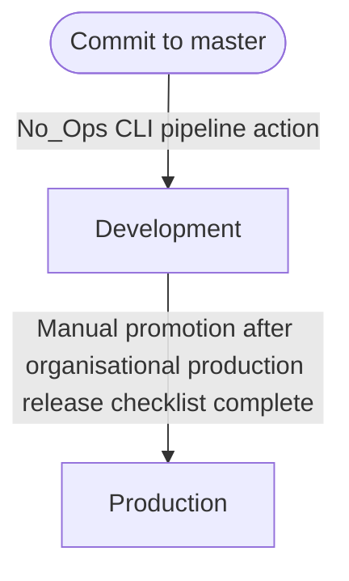

import { Image } from "@site/src/components/Image";

# Promoting deployments

If your organisation requires certain processes or checks to be made before deploying to a production environment, you can use the compute deployments tab to manually promote a deployment to another environment.

The following organisational development process is assumed in this scenario:

---

Clicking the `Deployments` tab inside of a compute will allow you to view the full deployment history.

To promote a deployment to another environment, simply click the `Deploy` button for the version you want.

<Image src="/docs/deployments/view_deployments.webp" />
<Image src="/docs/deployments/new_deployment_dialog.webp" />

Once the deployment has been triggered, you'll be redirected to the deployment revision page where you can:

- View the deployment status
- View the resources that are being deployed
- Redeploy or delete the deployment from the specified environment.

<Image src="/docs/deployments/view_deployment_revision.webp" />
