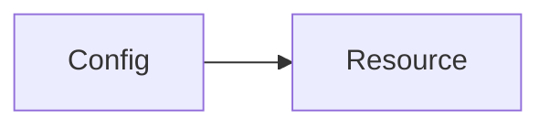
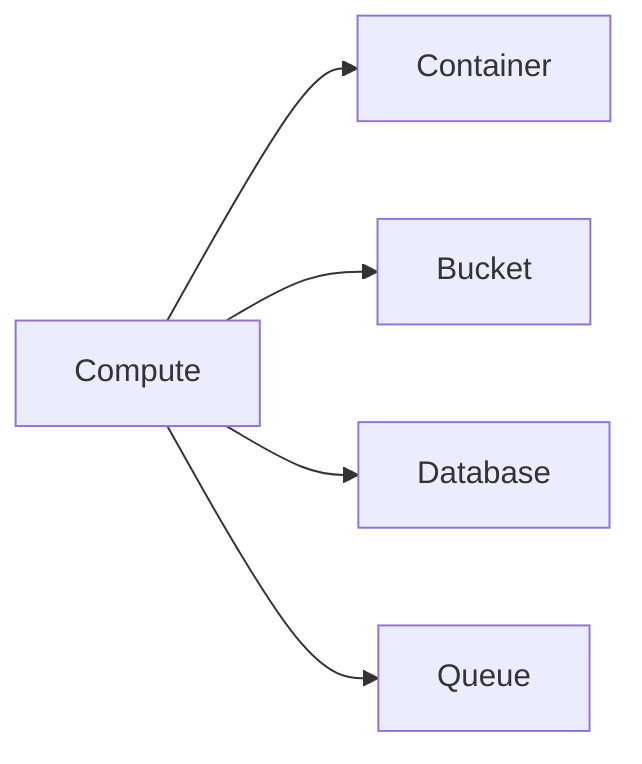
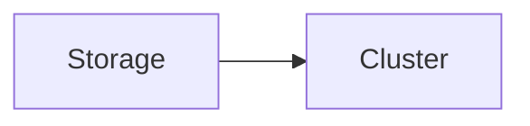
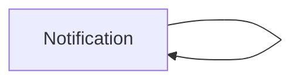

# Introduction

## Welcome to No_Ops!

No_Ops is the modern infrastructure platform for software engineers.

Rather than being slowed down by DevOps and worried about security and performance, No_Ops allows you to focus on your product.

---

## Getting started

Before getting into any setup, we'd like to go over some No_Ops specific concepts:

### Configs

:::tip[Configs]
Configs are the main building block in No_Ops, you will spend most of your time creating and managing configs.
:::

There are three types of configs:

1. Compute

   - EC2 instances

2. Storage

   - RDS database clusters

3. Integration

   - SNS topics
   - SQS queues

### Resources

:::tip[Resources]
Resources are the actual infrastructure behind your configs. **Each config has at least once resource.**
:::

 

A config by itself is just a placeholder, it doesn't do anything until a resource is added to it.

See each config mapped to its possible resources below:

 

 
 
 

 
 
 

 
 
 

:::note[Next step]
Start by [connecting your AWS account](./getting-started/connect-aws-account.mdx).
:::
